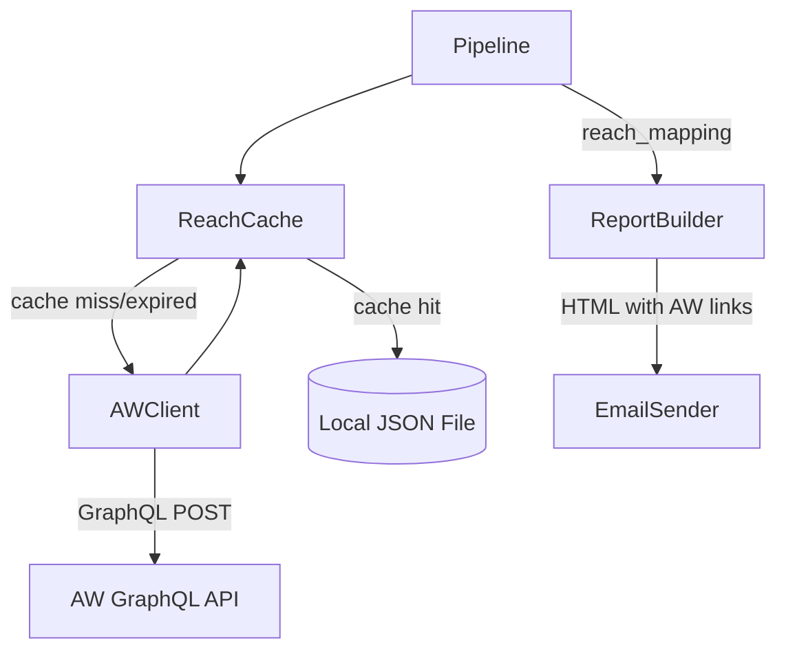

# Design Document: AW Reach Links

## Overview

This feature adds American Whitewater (AW) reach links to the existing gauge entries in notification emails. The system queries AW's GraphQL API to build a mapping from USGS gauge numbers to AW river reaches, caches the mapping locally as JSON with TTL-based expiration, and passes the mapping to the report builder so each gauge entry can display clickable links to associated AW river run pages.

The design introduces three new components:
1. **AWClient** — queries the AW GraphQL API to fetch gauge-to-reach associations
2. **ReachCache** — manages local JSON file caching with TTL expiration
3. **ReachMapping integration** — extends the existing `ReportBuilder` and `Pipeline` to consume reach data

The approach is non-blocking: if the AW API is unreachable and no valid cache exists, the pipeline proceeds without reach links rather than halting.

## Architecture



### Data Flow

1. Pipeline starts, reaches the report-building phase
2. Pipeline asks `ReachCache` for the current `ReachMapping`
3. `ReachCache` checks if the local JSON file exists and is within TTL
   - If valid: deserializes and returns the mapping
   - If expired/missing/corrupt: calls `AWClient.fetch_reach_mapping()` to get fresh data, persists it, returns it
4. Pipeline passes the `ReachMapping` to `ReportBuilder`
5. `ReportBuilder` looks up each gauge number in the mapping and renders AW reach links below gauge details

### API Strategy

AW's GraphQL API exposes `getGaugeInformationForReachID(id)` which returns gauge associations for a single reach. The state-based reach listing at `/content/River/view/river-index/state/{state_code}` provides all reaches for a state.

Our approach:
1. Query AW's GraphQL API with a batch query to get reaches for the configured state(s)
2. For each reach, extract the gauge associations (source="usgs", source_id = USGS site number)
3. Invert the mapping: from reach→gauges to gauge→reaches

Since the AW API's primary query pattern is reach→gauges, we query all reaches for the relevant states and build the inverted index. This is done infrequently (cached with 7-day default TTL) so the volume of requests is acceptable.

**GraphQL Query Pattern:**
```graphql
{
  getGaugeInformationForReachID(id: <reach_id>) {
    gauges {
      gauge {
        source
        source_id
      }
    }
  }
}
```

We batch multiple reach IDs into sequential queries to minimize round trips while respecting AW's server resources.

## Components and Interfaces

### AWClient (`src/aw_client.py`)

```python
class AWClientError(Exception):
    """Raised when AW API communication fails."""

class AWClient:
    """Fetches gauge-to-reach associations from the AW GraphQL API."""

    def __init__(self, config: Config, http_client: requests.Session) -> None:
        ...

    def fetch_reach_mapping(self, state_codes: list[str]) -> dict[str, list[Reach]]:
        """Fetch the complete gauge-to-reach mapping for the given states.

        Args:
            state_codes: List of US state codes (e.g., ["OR", "WA"]).

        Returns:
            Dict mapping USGS gauge number (str) to list of Reach objects.

        Raises:
            AWClientError: If the API is unreachable or returns errors.
        """
        ...

    def _fetch_reaches_for_state(self, state_code: str) -> list[int]:
        """Get all reach IDs for a state from AW's state index.

        Returns:
            List of reach IDs for the given state.
        """
        ...

    def _fetch_gauges_for_reach(self, reach_id: int) -> list[dict]:
        """Query AW GraphQL for gauge associations of a single reach.

        Returns:
            List of gauge dicts with 'source', 'source_id' fields.
        """
        ...

    def _build_inverted_mapping(
        self, reach_gauge_pairs: list[tuple[int, str, str, str]]
    ) -> dict[str, list[Reach]]:
        """Invert reach→gauge pairs into gauge→reaches mapping.

        Args:
            reach_gauge_pairs: List of (reach_id, reach_name, gauge_source, gauge_source_id).

        Returns:
            Dict mapping USGS gauge number to list of Reach objects.
        """
        ...
```

### ReachCache (`src/reach_cache.py`)

```python
class ReachCache:
    """Manages local JSON caching of the AW reach mapping with TTL expiration."""

    def __init__(self, config: Config) -> None:
        ...

    def get_mapping(self, state_codes: list[str], aw_client: AWClient) -> dict[str, list[Reach]] | None:
        """Get the reach mapping, using cache if valid or fetching fresh data.

        Args:
            state_codes: States to fetch mapping for.
            aw_client: Client to use for fresh fetches.

        Returns:
            The reach mapping, or None if fetch fails and no valid cache exists.
        """
        ...

    def _is_cache_valid(self) -> bool:
        """Check if the cache file exists and is within TTL."""
        ...

    def _read_cache(self) -> dict[str, list[Reach]] | None:
        """Read and deserialize the cache file.

        Returns:
            The deserialized mapping, or None if file is missing/corrupt.
        """
        ...

    def _write_cache(self, mapping: dict[str, list[Reach]]) -> None:
        """Serialize and write the mapping to the cache file with timestamp."""
        ...
```

### Extended ReportBuilder

The existing `ReportBuilder` gains an optional `reach_mapping` parameter:

```python
def build_consolidated_report(
    self,
    grouped_subscriber: GroupedSubscriber,
    state_gauge_data: dict[str, dict[str, GaugeEntry]],
    reach_mapping: dict[str, list[Reach]] | None = None,
) -> str | None:
    ...

def _render_gauge_entry(
    self, gauge_number: str, entry: GaugeEntry,
    reach_mapping: dict[str, list[Reach]] | None = None,
) -> str:
    ...

def _render_reach_links(self, reaches: list[Reach]) -> str:
    """Render AW reach links HTML for a gauge entry."""
    ...
```

### Extended Pipeline

The pipeline gains a new step between gauge data fetch and report building:

```python
def _load_reach_mapping(self, state_codes: list[str]) -> dict[str, list[Reach]] | None:
    """Load reach mapping from cache or AW API.

    Returns:
        The reach mapping, or None if unavailable (pipeline continues without links).
    """
    ...
```

### Config Extensions

```python
@dataclass
class Config:
    # ... existing fields ...

    # AW API
    aw_graphql_url: str = "https://www.americanwhitewater.org/graphql"
    aw_reach_cache_file: str = "aw_reach_cache.json"
    aw_cache_ttl_seconds: int = 604800  # 7 days
    aw_request_timeout: int = 30
    aw_request_delay: float = 0.5  # Delay between API calls to be respectful
```

## Data Models

### New Models (`src/models.py`)

```python
@dataclass
class Reach:
    """An American Whitewater river reach."""
    reach_id: int
    reach_name: str

    @property
    def url(self) -> str:
        """The AW page URL for this reach."""
        return (
            f"https://www.americanwhitewater.org/content/River/view/"
            f"river-detail/{self.reach_id}/main"
        )
```

### Cache File Format

The JSON cache file stores the mapping plus metadata:

```json
{
  "timestamp": "2025-01-15T08:00:00+00:00",
  "state_codes": ["OR", "WA"],
  "mapping": {
    "14181500": [
      {"reach_id": 1234, "reach_name": "North Santiam - Upper"},
      {"reach_id": 1235, "reach_name": "North Santiam - Lower"}
    ],
    "14211720": [
      {"reach_id": 2001, "reach_name": "Clackamas - Three Lynx to Carter Bridge"}
    ]
  }
}
```

### Type Alias

```python
# Type alias for the reach mapping structure
ReachMapping = dict[str, list[Reach]]
```

## Correctness Properties

*A property is a characteristic or behavior that should hold true across all valid executions of a system — essentially, a formal statement about what the system should do. Properties serve as the bridge between human-readable specifications and machine-verifiable correctness guarantees.*

### Property 1: Serialization Round-Trip

*For any* valid ReachMapping (a dict mapping gauge number strings to lists of Reach objects with integer IDs and non-empty string names), serializing the mapping to JSON and then deserializing it back SHALL produce a ReachMapping equivalent to the original.

**Validates: Requirements 5.1, 5.2, 5.3**

### Property 2: Mapping Inversion Preserves All Associations

*For any* set of (reach_id, reach_name, gauge_number) triples, inverting the mapping from reach→gauges to gauge→reaches SHALL produce a mapping where every original triple is represented — each gauge_number key contains a Reach with the corresponding reach_id and reach_name, and no associations are lost or duplicated.

**Validates: Requirements 1.3, 1.4**

### Property 3: USGS Gauge Extraction Filters by Source

*For any* valid AW API response containing gauges with mixed sources (e.g., "usgs", "canada", "virtual"), the extraction logic SHALL include only gauges where source equals "usgs" and SHALL correctly map their source_id as the USGS gauge number. Non-USGS gauges SHALL be excluded from the resulting mapping.

**Validates: Requirements 1.2**

### Property 4: Reach Link Count Matches Mapping

*For any* gauge entry and reach mapping where the gauge number maps to N reaches (N ≥ 0), the rendered HTML for that gauge entry SHALL contain exactly N AW reach link elements. When N = 0, no reach link HTML SHALL be present.

**Validates: Requirements 3.1, 3.4, 3.5**

### Property 5: Reach Links Have Correct Format

*For any* Reach object with a given reach_id and reach_name, the rendered reach link HTML SHALL contain an anchor tag (`<a>`) whose href equals `https://www.americanwhitewater.org/content/River/view/river-detail/{reach_id}/main` and whose visible text contains the reach_name.

**Validates: Requirements 3.2, 3.3**

### Property 6: Cache TTL Validity

*For any* cache timestamp and TTL duration, the cache SHALL be considered valid if and only if the elapsed time since the timestamp is strictly less than the TTL. When elapsed time equals or exceeds the TTL, the cache SHALL be considered expired.

**Validates: Requirements 2.2, 2.3**

## Error Handling

### AWClient Errors

| Scenario | Behavior |
|----------|----------|
| Network timeout / connection error | Raise `AWClientError` with descriptive message |
| HTTP 4xx from AW API | Raise `AWClientError` (permanent error, no retry) |
| HTTP 5xx from AW API | Retry with backoff, then raise `AWClientError` |
| Malformed JSON response | Raise `AWClientError` with parse error details |
| GraphQL errors in response | Raise `AWClientError` with error message from API |

### ReachCache Errors

| Scenario | Behavior |
|----------|----------|
| Cache file missing | Treat as expired, trigger fresh fetch |
| Cache file corrupt/unparseable | Treat as expired, trigger fresh fetch |
| Cache file permission error on read | Treat as expired, trigger fresh fetch |
| Cache file permission error on write | Log warning, return mapping without caching |
| Fresh fetch fails, no valid cache | Return `None` (pipeline proceeds without links) |
| Fresh fetch fails, valid cache exists | Return cached mapping, log warning |

### Pipeline Graceful Degradation

The reach mapping is **non-critical**. The pipeline MUST NOT halt due to AW-related failures:
- If `ReachCache.get_mapping()` returns `None`, the pipeline passes `None` to `ReportBuilder`
- `ReportBuilder` renders gauge entries without reach links when mapping is `None` or gauge has no entries
- All AW-related failures are logged as warnings, not errors

## Testing Strategy

### Property-Based Tests (Hypothesis)

Property-based tests validate universal correctness properties across generated inputs. Each test runs a minimum of 100 iterations.

| Property | Test File | What's Generated |
|----------|-----------|-----------------|
| Property 1: Serialization Round-Trip | `tests/property/test_reach_cache_props.py` | Random ReachMapping instances (varying gauge counts, reach counts, ID ranges, unicode names) |
| Property 2: Mapping Inversion | `tests/property/test_aw_client_props.py` | Random lists of (reach_id, reach_name, gauge_number) triples |
| Property 3: USGS Extraction | `tests/property/test_aw_client_props.py` | Random AW API response structures with mixed gauge sources |
| Property 4: Reach Link Count | `tests/property/test_reach_report_props.py` | Random gauge entries paired with random reach mappings (0-5 reaches per gauge) |
| Property 5: Reach Link Format | `tests/property/test_reach_report_props.py` | Random Reach objects with varying IDs and names (including unicode) |
| Property 6: Cache TTL Validity | `tests/property/test_reach_cache_props.py` | Random timestamps and TTL durations |

**Library:** Hypothesis (already used in the project)
**Configuration:** `@settings(max_examples=100)` on each test
**Tag format:** `# Feature: aw-reach-links, Property N: <property_text>`

### Unit Tests

| Test | Purpose |
|------|---------|
| `test_aw_client_error_on_network_failure` | Verify AWClientError raised on connection errors |
| `test_aw_client_error_on_http_error` | Verify AWClientError raised on 4xx/5xx |
| `test_cache_returns_none_on_corrupt_file` | Verify corrupt cache triggers fresh fetch |
| `test_pipeline_proceeds_without_reach_links` | Verify pipeline doesn't halt when mapping unavailable |
| `test_pipeline_uses_cached_mapping_on_fetch_failure` | Verify fallback to cache with warning log |
| `test_render_gauge_entry_without_reaches` | Verify no reach HTML when mapping is None |

### Integration Tests

| Test | Purpose |
|------|---------|
| `test_cache_write_and_read_cycle` | End-to-end cache persistence with real filesystem |
| `test_pipeline_with_reach_mapping` | Full pipeline run with mocked AW API returning reach data |

### Test Organization

```
tests/
├── property/
│   ├── test_aw_client_props.py      # Properties 2, 3
│   ├── test_reach_cache_props.py    # Properties 1, 6
│   └── test_reach_report_props.py   # Properties 4, 5
├── unit/
│   └── test_aw_reach_links.py       # Unit tests for error cases
└── integration/
    └── test_reach_pipeline.py       # Integration tests
```
