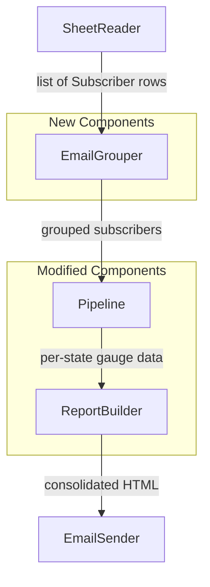

# Design Document: Email Consolidation

## Overview

This feature modifies the River Level Notification System pipeline to consolidate multiple subscriber rows sharing the same email address into a single email. Currently, each row in the Google Sheet triggers a separate email. After this change, the system groups rows by email (case-insensitive), merges gauge preferences per state, and produces one consolidated email per subscriber with distinct state sections.

The design introduces an `EmailGrouper` component between the sheet reader and the report builder, and extends the `ReportBuilder` to render multi-state consolidated reports.

## Architecture



**Data flow:**
1. `SheetReader` returns raw `Subscriber` rows (unchanged)
2. `EmailGrouper` groups rows by case-insensitive email, producing `GroupedSubscriber` objects
3. `Pipeline` iterates over grouped subscribers, fetches USGS data per unique state
4. `ReportBuilder` builds a single HTML report with state sections for each grouped subscriber
5. `EmailSender` sends one email per grouped subscriber (unchanged interface)

## Components and Interfaces

### EmailGrouper (New)

**Location:** `src/email_grouper.py`

**Responsibility:** Groups raw subscriber rows by email address (case-insensitive) and merges gauge preferences per state.

```python
class EmailGrouper:
    """Groups subscriber rows by email address for consolidated delivery."""

    def group_subscribers(
        self, subscribers: list[Subscriber]
    ) -> list[GroupedSubscriber]:
        """Group subscriber rows by case-insensitive email.

        Args:
            subscribers: Raw subscriber rows from the sheet reader.

        Returns:
            List of GroupedSubscriber objects, one per unique email.
        """
        ...
```

**Key behaviors:**
- Email comparison is case-insensitive (`User@Example.com` == `user@example.com`)
- Preserves the original email casing from the first occurrence
- Each `StatePreference` within a group preserves the gauge list and state code from the original row
- Merges gauge lists for same-state rows using set union
- An empty gauge list for any row in a state means "include all gauges" for that state

### ReportBuilder (Modified)

**Location:** `src/report_builder.py`

**New method:**

```python
def build_consolidated_report(
    self,
    grouped_subscriber: GroupedSubscriber,
    state_gauge_data: dict[str, dict[str, GaugeEntry]],
) -> str | None:
    """Build a consolidated HTML report with state sections.

    Args:
        grouped_subscriber: The grouped subscriber with state preferences.
        state_gauge_data: Dict mapping state_code -> {gauge_number -> GaugeEntry}.

    Returns:
        HTML string with state sections, or None if no content for any state.
    """
    ...
```

**Key behaviors:**
- Produces one state section per unique state that has matching gauge data
- Each state section starts with a visible heading (full state name)
- State sections are ordered alphabetically by full state name
- Skips states with no matching gauges (no empty sections)
- Returns `None` if all states produce no content

### Pipeline (Modified)

**Location:** `src/pipeline.py`

**Changes:**
- After reading subscribers, call `EmailGrouper.group_subscribers()`
- Iterate over `GroupedSubscriber` objects instead of raw `Subscriber` rows
- Call `build_consolidated_report()` instead of `build_report()`
- Use a generic subject line (no single-state reference) for multi-state subscribers
- Preserve single-state subject line format for single-state subscribers

### Config (Modified)

**Location:** `src/config.py`

**Changes:**
- Add a `consolidated_email_subject` field for multi-state emails (e.g., `"Current River Levels"`)

## Data Models

### New: GroupedSubscriber

```python
@dataclass
class StatePreference:
    """Gauge preferences for a single state within a grouped subscriber."""
    state_code: str
    included_gauges: list[str]  # Empty = all gauges for this state

@dataclass
class GroupedSubscriber:
    """A subscriber with consolidated preferences from all their sheet rows."""
    email: str
    state_preferences: list[StatePreference]
```

### Gauge List Merging Logic

When multiple rows exist for the same email and same state:
- If **any** row has an empty gauge list → result is empty (include all gauges)
- Otherwise → result is the **set union** of all gauge lists

```python
def merge_gauge_lists(gauge_lists: list[list[str]]) -> list[str]:
    """Merge multiple gauge inclusion lists for the same state.

    If any list is empty (meaning 'all gauges'), returns empty.
    Otherwise returns the union of all lists.
    """
    if any(len(gl) == 0 for gl in gauge_lists):
        return []
    merged = set()
    for gl in gauge_lists:
        merged.update(gl)
    return sorted(merged)
```

## Correctness Properties

*A property is a characteristic or behavior that should hold true across all valid executions of a system — essentially, a formal statement about what the system should do. Properties serve as the bridge between human-readable specifications and machine-verifiable correctness guarantees.*

### Property 1: Case-insensitive email grouping

*For any* list of subscriber rows, the number of groups produced by the EmailGrouper SHALL equal the number of case-insensitively unique email addresses in the input.

**Validates: Requirements 1.1, 1.3**

### Property 2: Data preservation during grouping

*For any* list of subscriber rows, after grouping, the total number of StatePreference entries across all groups SHALL equal the number of input rows, and each original row's state code and gauge list SHALL appear in exactly one group's state preferences.

**Validates: Requirements 1.2**

### Property 3: One state section per unique state

*For any* grouped subscriber with N unique states that have available gauge data, the consolidated report SHALL contain exactly N state section headings.

**Validates: Requirements 2.1, 4.1**

### Property 4: State sections ordered alphabetically

*For any* consolidated report containing multiple state sections, the state name headings SHALL appear in alphabetical order within the HTML output.

**Validates: Requirements 2.3**

### Property 5: Gauge list union with empty-list dominance

*For any* set of gauge inclusion lists for the same state, if any list is empty then the merged result SHALL be empty (include all gauges); otherwise the merged result SHALL be the set union of all lists.

**Validates: Requirements 2.4, 2.5**

### Property 6: Empty state sections excluded

*For any* grouped subscriber where some states have no matching gauges in the available data, the consolidated report SHALL not contain state section headings for those states.

**Validates: Requirements 3.3**

### Property 7: All-empty states returns None

*For any* grouped subscriber where no states have any matching gauge data, the report builder SHALL return None.

**Validates: Requirements 3.4**

## Error Handling

| Scenario | Behavior |
|----------|----------|
| Subscriber row with empty email | Skipped during sheet reading (existing behavior, unchanged) |
| Subscriber row with invalid state code | State code preserved as-is; USGS fetch will fail for that state, and the state section is excluded from the report |
| All states for a subscriber have no data | Email is skipped; logged as "No matching gauges or no data available" |
| Some states have data, some don't | Only states with data are included; no empty sections |
| EmailGrouper receives empty subscriber list | Returns empty list; pipeline logs and exits gracefully |
| USGS fetch fails for one state | Pipeline halts entirely (existing behavior — all-or-nothing fetch) |

## Testing Strategy

### Property-Based Tests (Hypothesis)

The project already uses Hypothesis for property-based testing. Each correctness property above maps to one or more property-based test functions.

**Library:** `hypothesis` (already in `requirements.txt`)
**Location:** `tests/property/test_email_grouper_props.py` and `tests/property/test_consolidated_report_props.py`
**Configuration:** Minimum 100 examples per test (`@settings(max_examples=100)`)

Each test is tagged with:
```
# Feature: email-consolidation, Property {number}: {property_text}
```

**Property test targets:**
- Properties 1, 2, 5 → test `EmailGrouper.group_subscribers()` and `merge_gauge_lists()`
- Properties 3, 4, 6, 7 → test `ReportBuilder.build_consolidated_report()`

### Unit Tests

**Location:** `tests/unit/test_email_consolidation.py`

- Subject line uses generic format for multi-state subscribers (Req 3.2)
- Subject line uses state-specific format for single-state subscribers (Req 4.1)
- Pipeline sends exactly one email per grouped subscriber (integration of grouper + sender)
- Single-row subscriber produces same delivery behavior as before (Req 4.2)

### Integration Tests

**Location:** `tests/integration/test_consolidation_pipeline.py`

- End-to-end pipeline run with mocked Sheet/USGS/Gmail verifying consolidated output
- Verify email count matches unique subscriber count
- Verify backward compatibility for single-row subscribers
