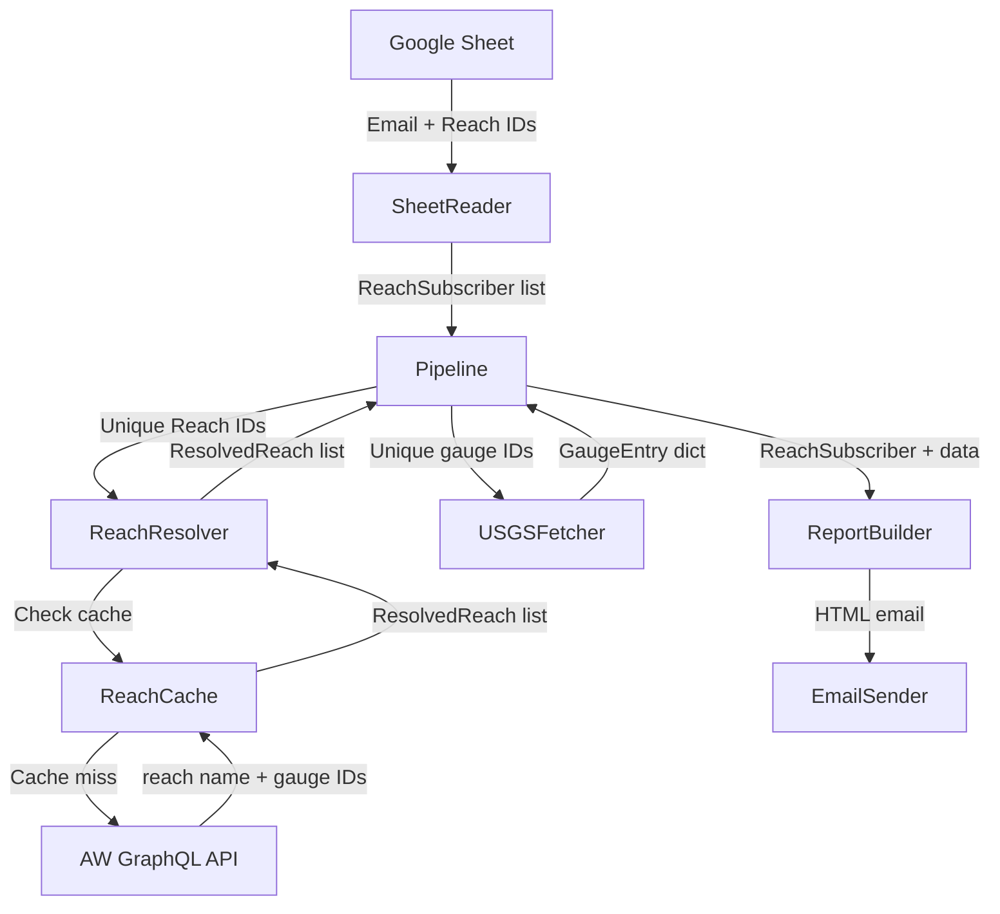

# Design Document: Reach-First Subscriptions

## Overview

This design replaces the gauge-first subscription model with a reach-first approach. Subscribers specify American Whitewater (AW) reach IDs in the spreadsheet. The system resolves each reach ID to its name and associated USGS gauge via the AW GraphQL API, fetches flow data from USGS for only the needed gauges, and delivers emails organized by reach.

The key architectural shift: instead of fetching all gauges for a US state and filtering, the system fetches only the specific gauges associated with subscriber reaches. This eliminates state-based logic, the EmailGrouper, and the GroupedSubscriber model entirely.

**Version:** 1.0.0 (breaking change to spreadsheet schema)

## Architecture



**Data flow:**
1. SheetReader reads (email, reach_ids) rows → produces `ReachSubscriber` objects
2. Pipeline collects all unique reach IDs across subscribers
3. ReachResolver resolves each reach ID → `ResolvedReach` (name, gauge_id or None)
4. Pipeline collects unique gauge IDs from resolved reaches
5. USGSFetcher fetches flow data for those specific gauge IDs → `GaugeEntry` dict
6. ReportBuilder renders per-subscriber HTML using their ordered reaches + flow data
7. EmailSender delivers the report

## Components and Interfaces

### SheetReader (updated)

Reads the new 2-column spreadsheet format: `Email | Reach IDs`.

```python
class SheetReader:
    def get_subscribers(self) -> list[ReachSubscriber]:
        """Parse spreadsheet rows into ReachSubscriber objects.
        
        - Skips rows with blank email
        - Skips rows with empty Reach IDs (logs warning)
        - Parses comma-separated integers from column B
        - Skips non-integer values (logs warning)
        - Deduplicates reach IDs preserving first-occurrence order
        """
        ...

    def validate_structure(self) -> bool:
        """Validate header row: 'Email' (A), 'Reach IDs' (B)."""
        ...
```

**Header constants change:**
- `EXPECTED_HEADER_COL_B` changes from `"include gauges"` to `"reach ids"`
- Column C validation removed entirely

### ReachResolver (new)

Resolves reach IDs to names and USGS gauge associations. Adapts the existing `AWClient._fetch_gauges_for_reach` method.

```python
class ReachResolver:
    def __init__(self, config: Config, http_client: requests.Session, cache: ReachCache):
        ...

    def resolve_reaches(self, reach_ids: list[int]) -> dict[int, ResolvedReach]:
        """Resolve a list of reach IDs to ResolvedReach objects.
        
        - Checks cache first (per-reach entries with TTL)
        - Queries AW API for cache misses
        - Updates cache with fresh results
        - Returns mapping of reach_id -> ResolvedReach
        - Marks unreachable reaches as unresolvable (does not halt)
        """
        ...

    def _query_reach(self, reach_id: int) -> ResolvedReach:
        """Query AW API for a single reach's name and gauge associations."""
        ...

    def _extract_reach_name(self, reach_data: dict) -> str:
        """Combine river, section, altname into display name."""
        ...

    def _extract_usgs_gauge(self, gauges: list[dict]) -> str | None:
        """Return source_id of first gauge with source='usgs', or None."""
        ...
```

### ReachCache (updated)

Changes from state-based mapping cache to per-reach entry cache.

```python
class ReachCache:
    def get_reach(self, reach_id: int) -> ResolvedReach | None:
        """Get cached reach data if within TTL. Returns None on miss/expiry."""
        ...

    def put_reach(self, reach_id: int, resolved: ResolvedReach) -> None:
        """Store a resolved reach entry with current timestamp."""
        ...

    def get_stale_reach(self, reach_id: int) -> ResolvedReach | None:
        """Get cached reach data regardless of TTL (for fallback)."""
        ...
```

**Cache file format (JSON):**
```json
{
  "reaches": {
    "1493": {
      "reach_name": "Clackamas River - Three Lynx to North Fork Reservoir",
      "gauge_id": "14209500",
      "cached_at": "2025-01-15T08:00:00+00:00"
    }
  }
}
```

### USGSFetcher (updated)

Adds a method to fetch specific gauge IDs rather than all gauges for a state.

```python
class USGSFetcher:
    def fetch_gauges_by_ids(self, gauge_ids: list[str]) -> dict[str, GaugeEntry]:
        """Fetch current readings for specific gauge IDs.
        
        Uses USGS API with sites= parameter instead of stateCd=.
        Returns mapping of gauge_number -> GaugeEntry.
        Skips gauges that return errors (does not halt pipeline).
        """
        ...
```

**USGS API URL format:**
```
https://waterservices.usgs.gov/nwis/iv/?sites={comma_separated_ids}&parameterCd=00060&format=json
```

### ReportBuilder (rewritten)

Renders reach-first HTML emails.

```python
class ReportBuilder:
    def build_report(
        self,
        subscriber: ReachSubscriber,
        resolved_reaches: dict[int, ResolvedReach],
        gauge_data: dict[str, GaugeEntry],
    ) -> str | None:
        """Build HTML report for a subscriber.
        
        - Iterates subscriber's reach_ids in order
        - For each reach: renders name (AW link), flow data, gauge link
        - Reaches with no gauge show "No gauge data available"
        - Returns None if no reaches could be rendered
        """
        ...

    def _render_reach_entry(
        self, resolved: ResolvedReach, gauge_entry: GaugeEntry | None
    ) -> str:
        """Render a single reach entry as HTML."""
        ...
```

### Pipeline (simplified)

No more state grouping, EmailGrouper, or consolidated reports.

```python
class Pipeline:
    def run(self) -> RunSummary:
        """Execute: validate → read subscribers → resolve reaches → 
        fetch USGS → build reports → send emails → summary."""
        ...
```

### ConfigValidator (simplified)

- Removes state code validation
- Updates expected header from "include gauges" to "reach ids"
- Removes column C validation

### Config (updated)

- Removes `usgs_state_code` field
- Removes `email_subject` template with `{state_name}`
- Removes `consolidated_email_subject`
- Adds single `email_subject: str = "Current River Levels"`
- Keeps all AW-related config fields

## Data Models

```python
@dataclass
class ReachSubscriber:
    """A subscriber with their ordered list of reach IDs."""
    email: str
    reach_ids: list[int]  # Ordered, deduplicated


@dataclass
class ResolvedReach:
    """A reach resolved from the AW API."""
    reach_id: int
    reach_name: str
    gauge_id: str | None  # USGS gauge number, or None if no USGS gauge

    @property
    def aw_url(self) -> str:
        return (
            f"https://www.americanwhitewater.org/content/River/view/"
            f"river-detail/{self.reach_id}/main"
        )


@dataclass
class GaugeEntry:
    """A single river gauge reading from USGS (unchanged)."""
    gauge_number: str
    gauge_name: str
    usgs_page_url: str
    reading_datetime: str
    flow_level: str


@dataclass
class RunSummary:
    """Summary of a pipeline execution run."""
    total_subscribers: int
    emails_sent: int
    emails_failed: int
    subscribers_skipped: int
    skip_reasons: list[str]
    start_time: datetime
    end_time: datetime
```

**Models removed:**
- `Subscriber` (replaced by `ReachSubscriber`)
- `StatePreference`
- `GroupedSubscriber`
- `Reach` (replaced by `ResolvedReach`)
- `ReachMapping` type alias

## Correctness Properties

*A property is a characteristic or behavior that should hold true across all valid executions of a system — essentially, a formal statement about what the system should do. Properties serve as the bridge between human-readable specifications and machine-verifiable correctness guarantees.*

### Property 1: Reach ID parsing round-trip

*For any* list of positive integers, formatting them as a comma-separated string (with arbitrary whitespace around commas and numbers) and parsing with the Sheet_Reader's parse function SHALL produce the same list of integers.

**Validates: Requirements 1.2, 1.3, 7.3**

### Property 2: Blank email filtering

*For any* list of spreadsheet rows where some rows have blank or whitespace-only emails, the Sheet_Reader SHALL return only subscribers whose emails are non-empty after trimming.

**Validates: Requirements 1.4**

### Property 3: Empty reach IDs filtering

*For any* list of spreadsheet rows where some rows have empty Reach IDs columns, the Sheet_Reader SHALL exclude those rows from the returned subscriber list.

**Validates: Requirements 1.5**

### Property 4: Reach name formatting

*For any* combination of river, section, and altname strings (where at least one of river/section is non-empty), the reach name formatter SHALL produce a string containing all non-empty components joined by " - " with altname in parentheses if present.

**Validates: Requirements 2.2**

### Property 5: First USGS gauge extraction

*For any* list of gauge association dicts, the USGS gauge extractor SHALL return the `source_id` of the first dict where `source` equals "usgs" (case-insensitive), or None if no such dict exists.

**Validates: Requirements 2.3, 2.4, 2.5**

### Property 6: Gauge ID deduplication

*For any* collection of resolved reaches (some sharing the same gauge_id), the set of gauge IDs passed to the USGS fetcher SHALL equal the unique non-None gauge_ids from the resolved reaches.

**Validates: Requirements 3.2**

### Property 7: Report contains AW link for every reach

*For any* resolved reach with a non-empty name, the rendered HTML for that reach entry SHALL contain an anchor tag linking to the correct AW URL (`river-detail/{reach_id}/main`).

**Validates: Requirements 4.1**

### Property 8: Report contains flow data when gauge data present

*For any* reach entry where gauge data is available, the rendered HTML SHALL contain both the flow level value (in cfs) and the formatted reading timestamp.

**Validates: Requirements 4.2**

### Property 9: Report contains USGS link when gauge present

*For any* reach entry where a USGS gauge is associated, the rendered HTML SHALL contain an anchor tag linking to the USGS monitoring page for that gauge number.

**Validates: Requirements 4.3**

### Property 10: Report preserves subscriber reach order

*For any* subscriber with an ordered list of reach IDs, the rendered report SHALL contain reach entries in the same order as the subscriber's reach_ids list.

**Validates: Requirements 4.5**

### Property 11: Cache serialization round-trip

*For any* valid ResolvedReach object, writing it to the cache and reading it back SHALL produce an equivalent ResolvedReach with the same reach_id, reach_name, and gauge_id.

**Validates: Requirements 6.1**

### Property 12: Invalid reach ID filtering

*For any* comma-separated string containing a mix of valid positive integers and non-integer tokens, the parser SHALL return only the valid positive integers in their original order.

**Validates: Requirements 7.1**

### Property 13: Deduplication preserves first-occurrence order

*For any* list of integers with duplicates, deduplication SHALL produce a list containing each unique value exactly once, in the order of its first appearance in the input.

**Validates: Requirements 7.2**

### Property 14: Run summary counts consistency

*For any* pipeline execution, the run summary SHALL satisfy: `emails_sent + emails_failed + subscribers_skipped == total_subscribers`.

**Validates: Requirements 8.4**

## Error Handling

| Error Condition | Behavior | Recovery |
|---|---|---|
| AW API unreachable for a reach | Log warning, use stale cache if available, mark reach unresolvable | Continue with other reaches |
| AW API returns GraphQL error | Log error with reach ID, mark reach unresolvable | Continue with other reaches |
| USGS API unreachable | Log error, mark affected reaches as no flow data | Continue with report (show "No data") |
| USGS returns no data for a gauge | Mark associated reaches as no current flow data | Render reach without flow info |
| All reaches fail for a subscriber | Skip subscriber, log reason | Continue with other subscribers |
| Sheet read failure | Halt pipeline, log error | Return empty RunSummary |
| Gmail auth failure | Halt pipeline, log error | Return RunSummary with 0 sent |
| Email send failure (individual) | Log failure, increment failed count | Continue with next subscriber |
| Invalid reach ID in spreadsheet | Skip that ID, log warning with email context | Parse remaining IDs |
| Cache file corrupt/unreadable | Treat as cache miss, fetch fresh from API | Overwrite cache on success |

**Design decision:** The pipeline is resilient at the per-subscriber and per-reach level. Individual failures do not halt processing of other subscribers. Only infrastructure-level failures (sheet read, Gmail auth) halt the pipeline.

## Testing Strategy

### Property-Based Tests (Hypothesis)

Each correctness property maps to a single Hypothesis test with minimum 100 iterations. Tests use the `@given` decorator with appropriate strategies.

**Library:** `hypothesis` (already in project)

**Configuration:**
```python
from hypothesis import settings, given
from hypothesis import strategies as st

@settings(max_examples=100)
```

**Tag format in test docstrings:**
```
Feature: reach-first-subscriptions, Property N: <property text>
```

**Key generators needed:**
- `reach_ids()` — lists of positive integers
- `reach_id_strings()` — comma-separated strings with random whitespace
- `gauge_lists()` — lists of dicts with `source` and `source_id` fields
- `resolved_reaches()` — ResolvedReach instances with optional gauge_id
- `subscriber_rows()` — tuples of (email, reach_ids_string) with some invalid

### Unit Tests (pytest)

Example-based tests for:
- Header validation (correct/incorrect headers)
- Timestamp formatting (known inputs → expected outputs)
- "No gauge data available" rendering
- Empty subscriber list handling
- Version number check (1.0.0)
- Cache TTL boundary (6 days 23h = valid, 7 days 1s = expired)

### Integration Tests

Mock-based tests for:
- Pipeline orchestration order
- AW API error handling and fallback to stale cache
- USGS API error handling per-gauge
- Email send failure continuation
- Full pipeline happy path with mocked external services

### Test Organization

```
tests/
├── test_sheet_reader.py      # Properties 1-3, 12-13 + header examples
├── test_reach_resolver.py    # Properties 4-5 + integration mocks
├── test_usgs_fetcher.py      # Property 6 + fetch-by-ids tests
├── test_report_builder.py    # Properties 7-10 + no-gauge example
├── test_reach_cache.py       # Property 11 + TTL examples
├── test_pipeline.py          # Property 14 + orchestration integration
```
