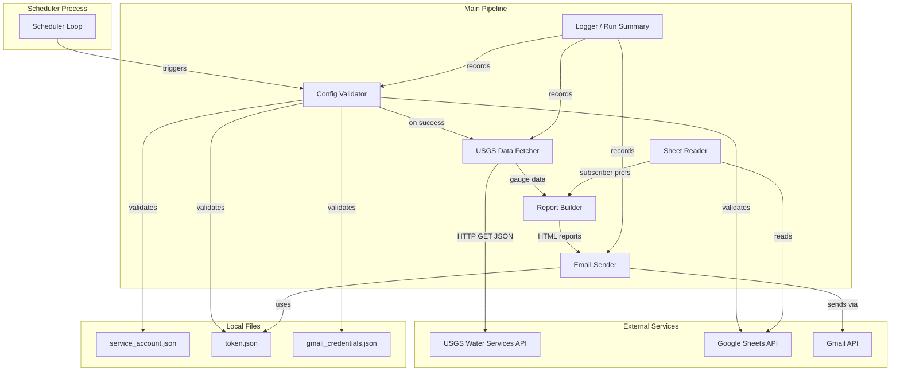
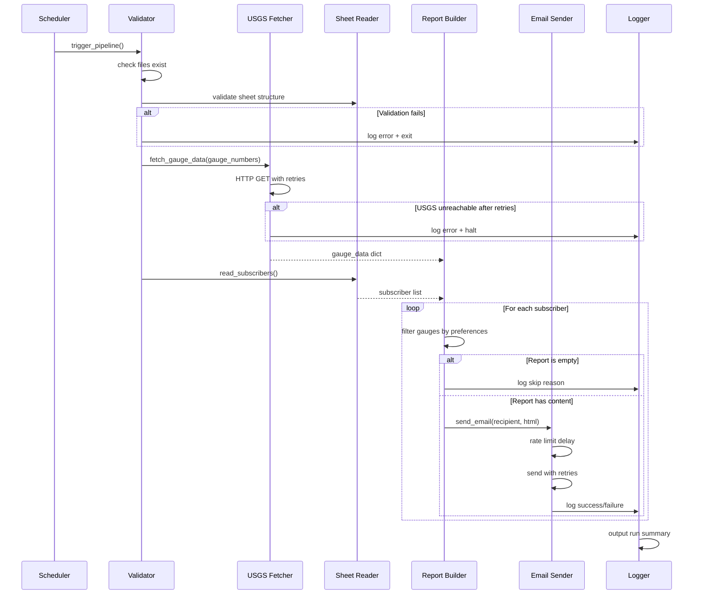

# Design Document: River Level Notification System

## Overview

The River Level Notification System is a Python application that retrieves real-time river gauge data from the USGS Water Services REST API for a configured US state, reads subscriber preferences from a Google Sheet, and sends personalized HTML email reports via the Gmail API. It replaces the existing Selenium-based screen scraping approach with a structured JSON API integration, improving reliability and eliminating browser dependencies.

The system consists of two executables:
1. **Main Pipeline** (`river_notify.py`) — the daily notification workflow
2. **Token Generator** (`create_token.py`) — a one-time OAuth2 setup utility

The pipeline runs on a configurable daily schedule and includes automatic token refresh, retry with exponential backoff, empty report suppression, structured logging, startup validation, and email rate limiting.

### Key Design Decisions

| Decision | Choice | Rationale |
|----------|--------|-----------|
| Data source | USGS Instantaneous Values REST API (JSON) | Eliminates Selenium dependency, faster, more reliable than scraping |
| Subscriber storage | Google Sheets (service account) | Non-technical users can manage subscriptions without code changes |
| Email delivery | Gmail API (OAuth2) | Reliable delivery, avoids SMTP configuration issues |
| State selection | Configurable state code (default OR) | Supports any US state without code changes |
| Versioning | Semantic versioning with auto-increment | Track deployments, communicate change impact |
| Scheduling | `schedule` library (in-process) | Simple, no external scheduler dependency (cron alternative documented) |
| Configuration | Python constants + external credential files | Matches existing project conventions |
| Retry strategy | Exponential backoff with jitter | Industry standard for transient failure recovery |

## Architecture



### Pipeline Execution Flow



## Components and Interfaces

### 1. Configuration Module (`config.py`)

Holds all configurable constants and file paths.

```python
@dataclass
class Config:
    # File paths
    service_account_file: str = "service_account.json"
    gmail_token_file: str = "token.json"
    gmail_client_secrets_file: str = "gmail_credentials.json"

    # Google Sheet
    spreadsheet_id: str = ""
    
    # Email
    sender_email: str = ""
    email_subject: str = "Current {state_name} River Levels"  # Supports {state_name} placeholder

    # Scheduler
    schedule_time: str = "06:00"  # HH:MM format, local time

    # Retry
    max_retries: int = 3
    initial_backoff_seconds: float = 1.0
    backoff_multiplier: float = 2.0

    # Rate limiting
    email_delay_seconds: float = 1.0

    # USGS API
    usgs_base_url: str = "https://waterservices.usgs.gov/nwis/iv/"
    usgs_format: str = "json"
    usgs_parameter_code: str = "00060"  # Discharge (cubic feet/sec)
    usgs_state_code: str = "OR"  # Two-letter US state abbreviation (default: Oregon)
```

### 1b. Version Module (`src/__version__.py`)

Single source of truth for the application version.

```python
__version__ = "0.1.0"
```

The version is:
- Displayed on startup in logs
- Accessible via `--version` CLI flag on the main entry point
- Included in the run summary output
- Auto-incremented using `python-semantic-release` or a git pre-commit hook based on commit message conventions (e.g., `fix:` → PATCH, `feat:` → MINOR, `BREAKING CHANGE:` → MAJOR)

### 2. USGS Data Fetcher (`usgs_fetcher.py`)

Retrieves gauge data from the USGS Instantaneous Values API.

```python
class USGSFetcher:
    def __init__(self, config: Config, http_client: requests.Session):
        ...

    def fetch_gauge_data(self, gauge_numbers: list[str]) -> dict[str, GaugeEntry]:
        """
        Fetches current readings for the given gauge numbers.
        Returns a dict mapping gauge_number -> GaugeEntry.
        Raises USGSFetchError on unrecoverable failure.
        """
        ...

    def _build_request_url(self, gauge_numbers: list[str]) -> str:
        """Constructs the USGS API URL with sites and format parameters."""
        ...

    def _parse_response(self, json_data: dict) -> dict[str, GaugeEntry]:
        """Parses USGS JSON response into GaugeEntry objects."""
        ...
```

**API URL format:**
```
https://waterservices.usgs.gov/nwis/iv/?sites={comma_separated_gauge_numbers}&stateCd={state_code}&parameterCd=00060&format=json
```

**USGS JSON response structure** (relevant fields):
```json
{
  "value": {
    "timeSeries": [
      {
        "sourceInfo": {
          "siteName": "YAKIMA RIVER AT UMTANUM, WA",
          "siteCode": [{"value": "12484500"}]
        },
        "values": [
          {
            "value": [
              {"value": "1234", "dateTime": "2025-01-15T08:00:00.000-08:00"}
            ]
          }
        ]
      }
    ]
  }
}
```

### 3. Sheet Reader (`sheet_reader.py`)

Reads subscriber preferences from Google Sheets.

```python
class SheetReader:
    def __init__(self, config: Config):
        ...

    def authenticate(self) -> None:
        """Authenticates with Google Sheets using service account."""
        ...

    def get_gauge_numbers(self) -> list[str]:
        """Reads header row (row 2) to get gauge numbers from column D onward."""
        ...

    def get_subscribers(self) -> list[Subscriber]:
        """Reads subscriber rows (row 3+) and returns parsed Subscriber objects."""
        ...

    def validate_structure(self) -> bool:
        """Validates sheet has expected structure (header row with gauge numbers)."""
        ...
```

### 4. Report Builder (`report_builder.py`)

Builds personalized HTML email reports.

```python
class ReportBuilder:
    def build_report(
        self, subscriber: Subscriber, gauge_data: dict[str, GaugeEntry]
    ) -> str | None:
        """
        Builds HTML report for subscriber based on their gauge preferences.
        Returns HTML string, or None if no gauges have data (empty report).
        """
        ...

    def _render_gauge_entry(self, gauge_number: str, entry: GaugeEntry) -> str:
        """Renders a single gauge entry as HTML."""
        ...

    def _render_footer(self, version: str) -> str:
        """Renders the email footer with the application version number."""
        ...
```

### 5. Email Sender (`email_sender.py`)

Sends emails via Gmail API with rate limiting and retry.

```python
class EmailSender:
    def __init__(self, config: Config):
        ...

    def authenticate(self) -> None:
        """Loads OAuth2 token, refreshes if expired, builds Gmail service."""
        ...

    def send_email(self, recipient: str, html_body: str) -> bool:
        """
        Sends HTML email to recipient with retry logic.
        Returns True on success, False on permanent failure.
        """
        ...

    def _refresh_token_if_needed(self, creds: Credentials) -> Credentials:
        """Refreshes expired token and persists updated token to file."""
        ...

    def _apply_rate_limit(self) -> None:
        """Enforces configurable delay between consecutive sends."""
        ...
```

### 6. Retry Utility (`retry.py`)

Generic retry mechanism with exponential backoff.

```python
def retry_with_backoff(
    operation: Callable[[], T],
    max_retries: int,
    initial_backoff: float,
    multiplier: float,
    retryable_exceptions: tuple[type[Exception], ...],
) -> T:
    """
    Executes operation with exponential backoff on transient failures.
    Raises the last exception if all retries are exhausted.
    """
    ...
```

### 7. Config Validator (`validator.py`)

Validates all configuration at startup before pipeline execution.

```python
class ConfigValidator:
    def __init__(self, config: Config):
        ...

    def validate_all(self) -> list[str]:
        """
        Validates all configuration. Returns list of error messages.
        Empty list means all checks passed.
        """
        ...

    def _check_file_exists(self, path: str, description: str) -> str | None:
        ...

    def _check_sheet_accessible(self) -> str | None:
        ...
```

### 8. Logger (`logger.py`)

Structured logging with run summary tracking.

```python
class PipelineLogger:
    def __init__(self):
        self.emails_sent: int = 0
        self.emails_failed: int = 0
        self.subscribers_skipped: int = 0
        self.skip_reasons: list[str] = []
        ...

    def log(self, level: str, message: str) -> None:
        """Outputs structured log entry with timestamp and severity."""
        ...

    def record_send_success(self, recipient: str) -> None: ...
    def record_send_failure(self, recipient: str, error: str) -> None: ...
    def record_skip(self, recipient: str, reason: str) -> None: ...

    def output_summary(self, total_subscribers: int) -> None:
        """Outputs run summary with all counters."""
        ...
```

### 9. Token Generator (`create_token.py`)

Standalone utility for initial OAuth2 setup.

```python
def generate_token(client_secrets_path: str, token_output_path: str) -> None:
    """
    Runs OAuth2 consent flow and saves token to file.
    Requests gmail.send scope.
    """
    ...
```

### 10. Pipeline Orchestrator (`pipeline.py`)

Coordinates the full execution flow.

```python
class Pipeline:
    def __init__(self, config: Config):
        ...

    def run(self) -> None:
        """
        Executes the full pipeline:
        1. Validate configuration
        2. Read gauge numbers from sheet
        3. Fetch USGS data
        4. Read subscribers
        5. Build and send reports
        6. Output run summary
        """
        ...
```

### 11. Scheduler (`scheduler.py`)

Runs the pipeline on a daily schedule.

```python
def start_scheduler(config: Config) -> None:
    """
    Starts the scheduling loop. Runs pipeline daily at configured time.
    Blocks indefinitely.
    """
    ...
```

## Data Models

```python
@dataclass
class GaugeEntry:
    """A single river gauge reading."""
    gauge_number: str
    gauge_name: str
    usgs_page_url: str
    reading_datetime: str
    flow_level: str


@dataclass
class Subscriber:
    """A subscriber with their gauge preferences."""
    email: str
    subscribed_gauges: list[str]  # List of gauge numbers marked TRUE


@dataclass
class RunSummary:
    """Summary of a pipeline execution run."""
    total_subscribers: int
    emails_sent: int
    emails_failed: int
    subscribers_skipped: int
    skip_reasons: list[str]
    start_time: datetime
    end_time: datetime
```

### USGS API Response Mapping

| USGS JSON Path | Maps To |
|---|---|
| `value.timeSeries[].sourceInfo.siteCode[0].value` | `GaugeEntry.gauge_number` |
| `value.timeSeries[].sourceInfo.siteName` | `GaugeEntry.gauge_name` |
| `https://waterdata.usgs.gov/nwis/uv?site_no={gauge_number}` | `GaugeEntry.usgs_page_url` |
| `value.timeSeries[].values[0].value[-1].dateTime` | `GaugeEntry.reading_datetime` |
| `value.timeSeries[].values[0].value[-1].value` | `GaugeEntry.flow_level` |

### Google Sheet Structure

| Row | Col A | Col B | Col C | Col D | Col E | ... |
|-----|-------|-------|-------|-------|-------|-----|
| 1 | (ignored) | (ignored) | (ignored) | (ignored) | (ignored) | ... |
| 2 (Header) | | | | 12484500 | 12488500 | ... |
| 3+ (Subscribers) | | | user@email.com | TRUE | FALSE | ... |

## Correctness Properties

*A property is a characteristic or behavior that should hold true across all valid executions of a system — essentially, a formal statement about what the system should do. Properties serve as the bridge between human-readable specifications and machine-verifiable correctness guarantees.*

### Property 1: USGS JSON Parsing Extracts All Required Fields

*For any* valid USGS Instantaneous Values JSON response containing one or more time series entries, parsing the response SHALL produce a GaugeEntry for each time series that contains a non-empty gauge_number, gauge_name, usgs_page_url, reading_datetime, and flow_level.

**Validates: Requirements 1.4**

### Property 2: Subscriber Sheet Parsing Correctness

*For any* valid sheet data with a header row containing gauge numbers in columns D+ and subscriber rows with an email in column C and TRUE/FALSE flags in columns D+, parsing SHALL produce Subscriber objects where each subscriber's `subscribed_gauges` list contains exactly the gauge numbers whose corresponding column has a TRUE value.

**Validates: Requirements 2.2, 2.3, 2.5**

### Property 3: Report Contains Only Subscribed Gauges With Data

*For any* subscriber with a set of subscribed gauges and any gauge data dictionary, the built report SHALL include exactly those gauges that are both in the subscriber's subscribed list AND present in the gauge data dictionary — no more, no less.

**Validates: Requirements 3.1, 3.4**

### Property 4: HTML Rendering Contains All Required Gauge Information

*For any* GaugeEntry with non-empty fields, the rendered HTML string SHALL contain the USGS page URL as a clickable link, the gauge name, the reading date/time, and the flow level value.

**Validates: Requirements 3.2**

### Property 5: Independent Email Delivery

*For any* list of subscribers where some email sends succeed and some fail, the system SHALL attempt to send to every subscriber in the list regardless of prior failures. The total number of send attempts SHALL equal the number of subscribers with non-empty reports.

**Validates: Requirements 4.4, 4.5**

### Property 6: Retry With Exponential Backoff

*For any* operation that fails with a retryable error up to N times (where N ≤ max_retries), the retry mechanism SHALL attempt the operation exactly min(failure_count + 1, max_retries + 1) times, with each successive delay being at least multiplier times the previous delay.

**Validates: Requirements 9.1, 9.2**

### Property 7: Empty Report Suppression

*For any* subscriber whose subscribed gauges all have no data in the gauge data dictionary, the system SHALL NOT attempt to send an email to that subscriber.

**Validates: Requirements 10.1**

### Property 8: Run Summary Accuracy

*For any* pipeline execution with a known number of send successes, send failures, and skipped subscribers, the run summary counters SHALL exactly equal the actual counts of each outcome.

**Validates: Requirements 11.2**

### Property 9: Validation Failure Halts Pipeline

*For any* configuration state where at least one validation check fails, the system SHALL NOT execute any data retrieval or email send operations.

**Validates: Requirements 12.3**

### Property 10: Rate Limiting Enforcement

*For any* sequence of N email sends (N ≥ 2), the elapsed time between the start of consecutive send operations SHALL be at least the configured `email_delay_seconds`.

**Validates: Requirements 13.1**

## Error Handling

### Error Categories and Responses

| Error Type | Source | Response | Recovery |
|---|---|---|---|
| Config file missing/unreadable | Startup validation | Log specific error, exit immediately | Operator fixes file paths |
| Sheet inaccessible | Startup validation | Log error, exit immediately | Operator checks service account permissions |
| Sheet structure invalid | Startup validation | Log error, exit immediately | Operator fixes sheet layout |
| USGS API transient error (5xx, timeout) | Data fetch | Retry with exponential backoff | Auto-recovery on retry |
| USGS API permanent error (4xx) | Data fetch | Log error, halt run | Operator checks gauge numbers |
| Token expired | Email auth | Auto-refresh, persist new token | Auto-recovery |
| Refresh token revoked | Email auth | Log error requiring re-auth, halt | Operator runs Token Generator |
| Email send transient error (429, 5xx) | Email delivery | Retry with backoff, then skip subscriber | Auto-recovery or graceful degradation |
| Email send permanent error (4xx) | Email delivery | Log failure, continue to next subscriber | Operator checks recipient address |
| Empty subscriber email | Sheet reading | Skip row silently | No action needed |

### Retry Strategy Details

```
Attempt 1: immediate
Attempt 2: wait initial_backoff (1s default)
Attempt 3: wait initial_backoff * multiplier (2s default)
Attempt N: wait initial_backoff * multiplier^(N-2)
```

For HTTP 429 responses with a `Retry-After` header, the system uses the server-specified delay instead of the calculated backoff.

### Graceful Degradation

- Individual subscriber failures don't block other subscribers
- Missing gauge data results in omission from reports (not errors)
- Empty reports are suppressed (no unnecessary emails sent)

## Testing Strategy

### Property-Based Testing

The system uses **Hypothesis** (Python property-based testing library) to verify the correctness properties defined above.

**Configuration:**
- Minimum 100 iterations per property test
- Each test tagged with: `# Feature: river-level-notification-system, Property {N}: {description}`

**Property tests cover:**
- USGS JSON parsing (Property 1)
- Subscriber sheet parsing (Property 2)
- Report building logic (Property 3)
- HTML rendering completeness (Property 4)
- Independent delivery (Property 5)
- Retry mechanism (Property 6)
- Empty report suppression (Property 7)
- Run summary accuracy (Property 8)
- Validation halts pipeline (Property 9)
- Rate limiting (Property 10)

### Unit Tests (Example-Based)

Unit tests cover specific scenarios and edge cases:

- Token refresh success/failure paths (Requirements 8.1, 8.2, 8.3)
- Default configuration values (schedule time, retry count, delay)
- Log format verification (timestamps, severity levels)
- Scheduler default time (06:00 AM)
- Token Generator scope request

### Integration Tests

Integration tests verify external service interactions with mocks:

- USGS API request construction and response handling
- Google Sheets authentication and data retrieval
- Gmail API authentication and send flow
- Full pipeline orchestration (all steps called in order)

### Test Organization

```
tests/
├── property/
│   ├── test_usgs_parsing_props.py
│   ├── test_sheet_parsing_props.py
│   ├── test_report_builder_props.py
│   ├── test_email_sender_props.py
│   ├── test_retry_props.py
│   ├── test_summary_props.py
│   ├── test_validator_props.py
│   └── test_rate_limit_props.py
├── unit/
│   ├── test_config.py
│   ├── test_token_refresh.py
│   ├── test_logger.py
│   └── test_scheduler.py
└── integration/
    ├── test_usgs_integration.py
    ├── test_sheets_integration.py
    ├── test_gmail_integration.py
    └── test_pipeline_integration.py
```

### Dependencies for Testing

- `hypothesis` — property-based testing framework
- `pytest` — test runner
- `unittest.mock` — mocking external services
- `responses` or `requests-mock` — HTTP request mocking
