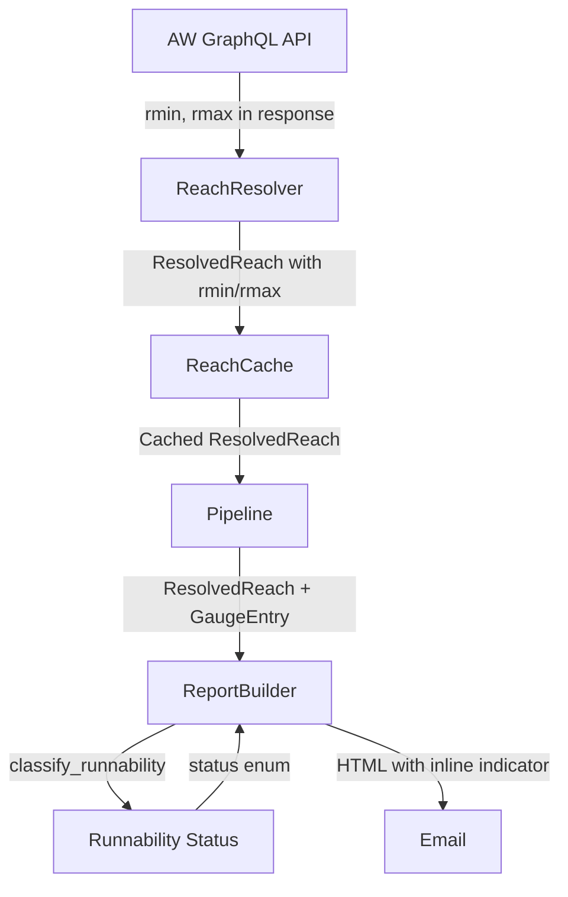

# Design Document: Runnability Indicator

## Overview

This feature adds a color-coded runnability indicator to email reports, showing whether each reach's current flow is within the paddleable range defined by the AW API. The indicator compares the current flow reading (from USGS or AW fallback) against the reach's `rmin`/`rmax` values and renders a colored dot + label ("● Runnable", "● Too Low", "● Too High") adjacent to the flow reading in the HTML email.

The implementation touches four layers of the pipeline:
1. **Data Model** — Add `rmin`/`rmax` fields to `ResolvedReach`
2. **Resolution** — Expand the GraphQL query to capture `rmin`/`rmax`
3. **Caching** — Serialize/deserialize `rmin`/`rmax` (backward-compatible)
4. **Rendering** — Classify flow vs range and render inline-styled indicator

## Architecture



The data flows linearly through the existing pipeline. The only new logic is a pure classification function and a small rendering addition. No new external calls or services are introduced.

## Components and Interfaces

### 1. `ResolvedReach` (src/models.py)

Add two optional fields to the existing dataclass:

```python
@dataclass
class ResolvedReach:
    reach_id: int
    reach_name: str
    gauge_id: str | None
    state: str | None = None
    aw_flow_data: AWFlowData | None = None
    rmin: float | None = None  # NEW: minimum runnable flow
    rmax: float | None = None  # NEW: maximum runnable flow
```

### 2. `RunnabilityStatus` Enum (src/models.py)

A simple string enum for classification results:

```python
from enum import Enum

class RunnabilityStatus(str, Enum):
    RUNNABLE = "Runnable"
    TOO_LOW = "Too Low"
    TOO_HIGH = "Too High"
    UNKNOWN = "Unknown"
```

### 3. `classify_runnability` Function (src/models.py)

A pure function that determines runnability status:

```python
def classify_runnability(
    flow: float | None,
    rmin: float | None,
    rmax: float | None,
) -> RunnabilityStatus:
    """Classify flow against runnable range.
    
    Returns UNKNOWN if any input is None.
    Returns RUNNABLE if rmin <= flow <= rmax.
    Returns TOO_LOW if flow < rmin.
    Returns TOO_HIGH if flow > rmax.
    """
```

**Design decision**: This function lives in `src/models.py` alongside the enum and data models because it's a pure domain logic function with no dependencies. It keeps the classification testable in isolation without importing the report builder.

### 4. `ReachResolver._query_reach` (src/reach_resolver.py)

Expand the GraphQL query string to include `rmin` and `rmax` in the gauge selection:

```graphql
getGaugeInformationForReachID(id: N) {
  gauges {
    gauge { source source_id name }
    gauge_reading reading updated rmin rmax
    metric { unit }
  }
}
```

Extract `rmin`/`rmax` from the first gauge entry that provides them, then pass to the `ResolvedReach` constructor.

### 5. `ReachCache` (src/reach_cache.py)

Serialize `rmin`/`rmax` in `put_reach`:
```python
entry = {
    "reach_name": resolved.reach_name,
    "gauge_id": resolved.gauge_id,
    "state": resolved.state,
    "rmin": resolved.rmin,   # NEW
    "rmax": resolved.rmax,   # NEW
    "cached_at": datetime.now(timezone.utc).isoformat(),
}
```

Deserialize in `_entry_to_resolved_reach`:
```python
rmin = entry.get("rmin")  # None if key absent (backward-compat)
rmax = entry.get("rmax")
# Convert to float if present
rmin = float(rmin) if rmin is not None else None
rmax = float(rmax) if rmax is not None else None
```

### 6. `ReportBuilder._render_reach_entry` (src/report_builder.py)

After rendering the flow data line, determine the runnability status and append the indicator HTML:

- For USGS reaches: convert `gauge_entry.flow_level` (string) to float, call `classify_runnability(flow, resolved.rmin, resolved.rmax)`
- For AW fallback reaches: use `resolved.aw_flow_data.reading` (already float), call `classify_runnability(flow, resolved.rmin, resolved.rmax)`
- For "Unknown" status or no flow data: render nothing

Indicator HTML uses inline CSS for email client compatibility:
- Runnable: `<span style="color: #2e7d32; font-weight: bold;">● Runnable</span>`
- Too Low: `<span style="color: #c62828; font-weight: bold;">● Too Low</span>`
- Too High: `<span style="color: #c62828; font-weight: bold;">● Too High</span>`

## Data Models

### ResolvedReach (updated)

| Field | Type | Description |
|-------|------|-------------|
| reach_id | int | AW reach identifier |
| reach_name | str | Display name |
| gauge_id | str \| None | USGS gauge number |
| state | str \| None | US state abbreviation |
| aw_flow_data | AWFlowData \| None | AW fallback flow data |
| **rmin** | **float \| None** | **Minimum runnable flow (new)** |
| **rmax** | **float \| None** | **Maximum runnable flow (new)** |

### RunnabilityStatus (new)

| Value | Meaning | Indicator Color |
|-------|---------|-----------------|
| RUNNABLE | Flow within [rmin, rmax] | Green (#2e7d32) |
| TOO_LOW | Flow below rmin | Red (#c62828) |
| TOO_HIGH | Flow above rmax | Red (#c62828) |
| UNKNOWN | Missing data | No indicator |

### Cache Entry Format (updated)

```json
{
  "reach_name": "Clackamas River - Three Lynx to North Fork Reservoir",
  "gauge_id": "14209500",
  "state": "OR",
  "rmin": 1000.0,
  "rmax": 9000.0,
  "cached_at": "2025-01-15T08:00:00+00:00"
}
```

Entries without `rmin`/`rmax` (pre-existing cache) are treated as `None` — no migration needed.

## Correctness Properties

*A property is a characteristic or behavior that should hold true across all valid executions of a system — essentially, a formal statement about what the system should do. Properties serve as the bridge between human-readable specifications and machine-verifiable correctness guarantees.*

### Property 1: Cache round-trip preserves rmin and rmax

*For any* valid ResolvedReach with any combination of rmin and rmax values (including None), writing it to the cache via `put_reach` and reading it back via `get_reach` SHALL produce a ResolvedReach with the same rmin and rmax values.

**Validates: Requirements 2.1, 2.2, 2.3**

### Property 2: Classification correctness for flow within range

*For any* flow reading and valid rmin/rmax range where rmin <= rmax, the `classify_runnability` function SHALL return RUNNABLE when rmin <= flow <= rmax, TOO_LOW when flow < rmin, and TOO_HIGH when flow > rmax.

**Validates: Requirements 3.1, 3.2, 3.3**

### Property 3: Missing data produces Unknown classification

*For any* combination of inputs where at least one of (flow, rmin, rmax) is None, the `classify_runnability` function SHALL return UNKNOWN.

**Validates: Requirements 3.4**

### Property 4: Rendered indicator matches runnability status

*For any* reach with flow data (USGS or AW) and non-null rmin/rmax, the rendered HTML SHALL contain the correct colored indicator text corresponding to the comparison of the flow reading against the range (green "Runnable" when in range, red "Too Low" when below, red "Too High" when above).

**Validates: Requirements 4.1, 4.2, 4.3, 5.1, 5.2**

### Property 5: Unknown status renders no indicator

*For any* reach where rmin or rmax is None (regardless of whether flow data is available), the rendered HTML SHALL NOT contain any runnability indicator text ("Runnable", "Too Low", or "Too High").

**Validates: Requirements 4.4, 4.6**

## Error Handling

| Scenario | Behavior |
|----------|----------|
| `rmin`/`rmax` missing from API response | Set to None on ResolvedReach; no indicator rendered |
| `rmin`/`rmax` not numeric in API response | Treat as None (defensive parsing) |
| `flow_level` string cannot be parsed to float | Treat as no flow reading; classify as Unknown |
| Cache entry missing `rmin`/`rmax` keys | Default to None (backward compatibility) |
| `rmin` > `rmax` in API data (invalid range) | Still classify literally (flow < rmin → Too Low, flow > rmax → Too High, between → Runnable) — this is AW's data responsibility |

The feature does not introduce any new failure modes that could halt the pipeline. All error cases degrade gracefully to "no indicator shown."

## Testing Strategy

### Property-Based Tests (Hypothesis)

The project uses **Hypothesis** for property-based testing with minimum 100 iterations per property.

| Property | Test Location | What It Verifies |
|----------|---------------|------------------|
| Property 1 | `tests/property/test_reach_cache_props.py` | Cache serialization round-trip for rmin/rmax |
| Property 2 | `tests/property/test_runnability_props.py` | Classification function correctness |
| Property 3 | `tests/property/test_runnability_props.py` | Unknown classification for missing data |
| Property 4 | `tests/property/test_report_builder_props.py` | Indicator rendering matches status |
| Property 5 | `tests/property/test_report_builder_props.py` | No indicator for Unknown status |

Each property test will:
- Run minimum 100 examples (`@settings(max_examples=100)`)
- Be tagged with: `Feature: runnability-indicator, Property N: {title}`
- Reference the design property in its docstring

### Unit Tests

| Test | What It Verifies |
|------|------------------|
| GraphQL query includes rmin/rmax fields | Requirement 1.1 |
| Resolver extracts rmin/rmax from first gauge entry | Requirement 1.2 |
| USGS flow_level string conversion to float | Requirement 5.1 edge cases |
| Inline CSS style attributes on indicator spans | Requirement 4.5 |

### Test Configuration

- Framework: pytest + hypothesis
- Property tests: `@settings(max_examples=100)`
- Tag format: `Feature: runnability-indicator, Property {number}: {property_text}`
