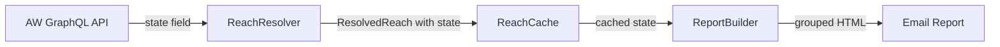

# Design Document: State-Grouped Email Reports

## Overview

This feature adds US state-based grouping to the email reports generated by the River Level Notification System. Currently, reports render reaches as a flat list in subscriber order. After this change, reaches will be grouped under state headings (full state names, alphabetically ordered), with an "Other" group for reaches lacking state data appearing last.

The implementation touches four components in a narrow vertical slice:
1. **ReachResolver** — add `state` to the GraphQL query fields
2. **ResolvedReach model** — add an optional `state` field
3. **ReachCache** — persist and load the `state` field (with backward-compatible handling of legacy entries)
4. **ReportBuilder** — group reaches by state with headings, preserving subscriber order within groups

No changes are needed to the subscriber spreadsheet, pipeline orchestration, USGS fetcher, or email sender.

## Architecture

The data flow is linear and additive:



The `state` field flows through the existing pipeline without altering control flow. The ReportBuilder is the only component whose output changes visibly — it introduces state-group headings and reorders reaches by group while preserving intra-group subscriber order.

## Components and Interfaces

### ReachResolver Changes

The `_query_reach` method's GraphQL query string changes from:

```graphql
{ reach(id: N) { river section altname } ... }
```

to:

```graphql
{ reach(id: N) { river section altname state } ... }
```

The `_query_reach` method extracts `state` from `reach_data` and passes it to the `ResolvedReach` constructor. A null/empty state from the API maps to `None`.

### ResolvedReach Model Changes

Add a `state: str | None` field with a default of `None`:

```python
@dataclass
class ResolvedReach:
    reach_id: int
    reach_name: str
    gauge_id: str | None
    state: str | None = None  # US state abbreviation (e.g., "OR", "WA")
```

The default ensures backward compatibility — existing code constructing `ResolvedReach` without `state` continues to work.

### ReachCache Changes

**Serialization** (`put_reach`): Include `"state": resolved.state` in the cached JSON entry.

**Deserialization** (`_entry_to_resolved_reach`): Read `entry.get("state")` and pass it to `ResolvedReach`. If the key is missing (legacy cache entry), `state` defaults to `None`.

Cache entry format becomes:

```json
{
  "reach_name": "Clackamas River - Three Lynx to North Fork Reservoir",
  "gauge_id": "14209500",
  "state": "OR",
  "cached_at": "2025-01-15T08:00:00+00:00"
}
```

### ReportBuilder Changes

The `build_report` method gains grouping logic:

1. Iterate subscriber's `reach_ids` in order, collecting `(state, reach_id)` pairs.
2. Group reaches by state, preserving subscriber order within each group.
3. Sort groups alphabetically by full state name (using `STATE_NAMES` mapping).
4. Place the "Other" group (reaches with `state=None`) last.
5. Render each group with an `<h2>` state heading followed by reach entries.

New CSS class `.state-heading` for the `<h2>` element.

If a state abbreviation is not found in `STATE_NAMES`, use the raw abbreviation as the heading text.

## Data Models

### ResolvedReach (updated)

| Field | Type | Description |
|-------|------|-------------|
| reach_id | int | AW reach ID |
| reach_name | str | Formatted display name |
| gauge_id | str \| None | USGS gauge number |
| state | str \| None | US state abbreviation from AW API |

### Cache Entry (updated)

| Field | Type | Description |
|-------|------|-------------|
| reach_name | str | Formatted display name |
| gauge_id | str \| None | USGS gauge number |
| state | str \| None | US state abbreviation |
| cached_at | str | ISO 8601 timestamp |

### State Group (internal to ReportBuilder)

Not a persisted model — a transient grouping structure used during report rendering:

| Field | Type | Description |
|-------|------|-------------|
| heading | str | Full state name or "Other" |
| reaches | list[tuple[ResolvedReach, GaugeEntry \| None]] | Ordered reach entries |


## Correctness Properties

*A property is a characteristic or behavior that should hold true across all valid executions of a system — essentially, a formal statement about what the system should do. Properties serve as the bridge between human-readable specifications and machine-verifiable correctness guarantees.*

### Property 1: Resolver extracts state from API response

*For any* valid AW API response containing a `state` field (including null and non-null values), the ReachResolver SHALL produce a ResolvedReach whose `state` field matches the API response value (with null/empty mapped to None).

**Validates: Requirements 1.2, 1.3**

### Property 2: Cache round-trip preserves state

*For any* valid ResolvedReach with any state value (including None), writing it to the cache via `put_reach` and reading it back via `get_reach` SHALL produce a ResolvedReach with the same `state` value.

**Validates: Requirements 3.1, 3.2**

### Property 3: State groups ordered alphabetically with "Other" last

*For any* subscriber report containing reaches from multiple states, the state group headings SHALL appear in alphabetical order by full state name, with reaches having no state grouped under "Other" appearing after all named state groups.

**Validates: Requirements 4.1, 4.4, 4.5**

### Property 4: State headings display full state name

*For any* reach with a state abbreviation present in STATE_NAMES, the report SHALL display the corresponding full state name as the group heading. For any abbreviation not in STATE_NAMES, the raw abbreviation SHALL be used as the heading.

**Validates: Requirements 4.2, 6.1, 6.2**

### Property 5: Intra-group subscriber order preserved

*For any* subscriber with multiple reaches in the same state, those reaches SHALL appear within their state group in the same relative order as in the subscriber's `reach_ids` list.

**Validates: Requirements 4.3**

## Error Handling

| Scenario | Handling |
|----------|----------|
| AW API returns null/empty state | Set `state = None` on ResolvedReach; reach appears in "Other" group |
| Unknown state abbreviation (not in STATE_NAMES) | Use raw abbreviation as heading text |
| Legacy cache entry missing `state` key | Default to `state = None` on load |
| All reaches have `state = None` | Report renders single "Other" group with all reaches |
| Mixed states with some None | Named groups appear alphabetically, "Other" group last |

No new exception types are needed. The existing error handling in ReachResolver (stale cache fallback, logging) remains unchanged.

## Testing Strategy

### Property-Based Tests (Hypothesis)

This project uses [Hypothesis](https://hypothesis.readthedocs.io/) for property-based testing. Each correctness property maps to a single property test with a minimum of 100 iterations.

| Property | Test File | What It Generates |
|----------|-----------|-------------------|
| Property 1: Resolver state extraction | `tests/property/test_reach_resolver_props.py` | Random API responses with varying state values |
| Property 2: Cache round-trip with state | `tests/property/test_reach_cache_props.py` | Random ResolvedReach objects with state field |
| Property 3: State group ordering | `tests/property/test_report_builder_props.py` | Subscribers with reaches spanning multiple states |
| Property 4: State heading full name | `tests/property/test_report_builder_props.py` | Reaches with known and unknown state abbreviations |
| Property 5: Intra-group order | `tests/property/test_report_builder_props.py` | Subscribers with multiple reaches per state |

Each test is tagged: **Feature: state-grouped-email, Property {number}: {title}**

Configuration: `@settings(max_examples=100)` on each property test.

### Unit Tests

Focused on specific examples and edge cases not covered by property tests:

- ResolvedReach constructed without `state` kwarg defaults to None (Requirement 2.2)
- GraphQL query string includes "state" in reach fields (Requirement 1.1)
- Legacy cache entry (no `state` key) loads with `state=None` (Requirement 3.3)
- Report with all reaches in one state produces single heading (visual check)
- Report with no gauge data still groups correctly

### Integration Tests

- End-to-end pipeline run with mocked AW API returning state data verifies the full flow from API response through cache to grouped email output.
