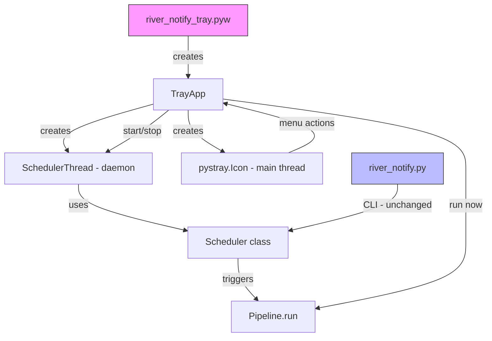
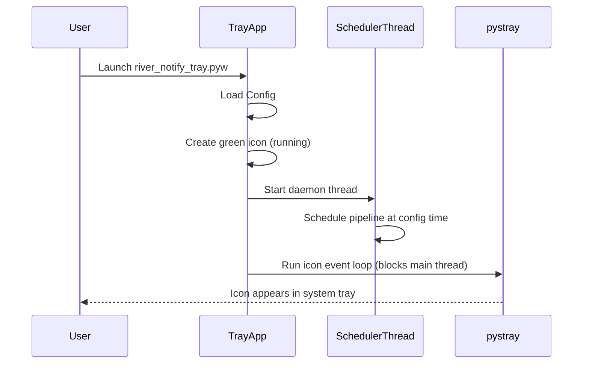
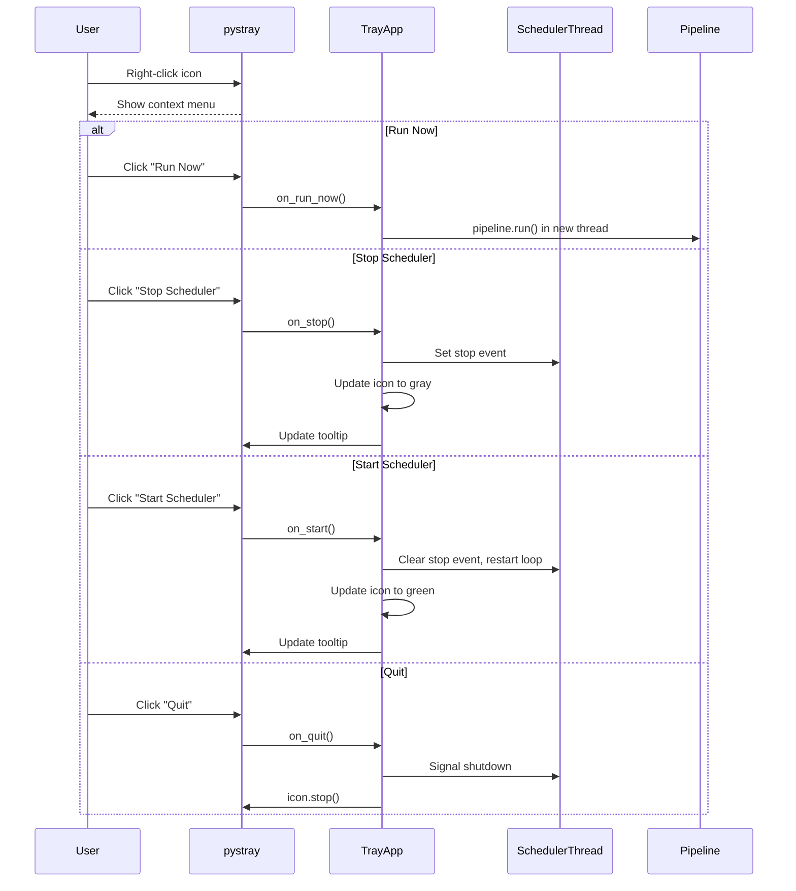

# Design Document: System Tray Scheduler

## Overview

This feature replaces the command-prompt-based scheduler with a Windows system tray application. The app runs without admin rights, sits in the notification area, and provides Start/Stop/Run Now/Quit controls via a right-click context menu. No command prompt window is visible to the user.

The system tray app uses `pystray` for the notification area icon and menu, `Pillow` for dynamic icon generation (green = running, gray = stopped), and runs the existing scheduler logic in a background daemon thread. The existing CLI entry point (`river_notify.py`) remains fully backward-compatible.

A new entry point file (`river_notify_tray.pyw`) uses the `.pyw` extension so Windows runs it with `pythonw.exe`, suppressing any console window.

## Architecture



## Sequence Diagrams

### App Startup



### Right-Click Menu Interactions



## Components and Interfaces

### Component 1: TrayApp

**Purpose**: Manages the system tray icon, context menu, and coordinates between the UI and the scheduler thread.

```python
class TrayApp:
    """System tray application controller."""

    def __init__(self, config: Config) -> None: ...
    def run(self) -> None: ...
    def on_run_now(self, icon: pystray.Icon, item: pystray.MenuItem) -> None: ...
    def on_start(self, icon: pystray.Icon, item: pystray.MenuItem) -> None: ...
    def on_stop(self, icon: pystray.Icon, item: pystray.MenuItem) -> None: ...
    def on_quit(self, icon: pystray.Icon, item: pystray.MenuItem) -> None: ...
    def _create_icon_image(self, running: bool) -> Image.Image: ...
    def _build_menu(self) -> pystray.Menu: ...
    def _update_tooltip(self) -> None: ...
```

**Responsibilities**:
- Create and manage the pystray.Icon instance
- Build the right-click context menu
- Dispatch menu actions to appropriate handlers
- Generate dynamic tray icons (green/gray circle)
- Update tooltip text based on scheduler state

### Component 2: SchedulerThread

**Purpose**: Runs the `schedule` library loop in a background daemon thread with start/stop control.

```python
class SchedulerThread:
    """Background thread that runs the schedule polling loop."""

    def __init__(self, config: Config) -> None: ...
    def start(self) -> None: ...
    def stop(self) -> None: ...
    def is_running(self) -> bool: ...
    def get_next_run_time(self) -> str | None: ...
    def run_now(self) -> None: ...
```

**Responsibilities**:
- Run the `schedule` polling loop in a daemon thread
- Support graceful stop via threading.Event
- Support restart without creating a new thread
- Execute pipeline immediately on "Run Now" command
- Report next scheduled run time for tooltip display

### Component 3: Refactored Scheduler (src/scheduler.py)

**Purpose**: The existing scheduler module, refactored to expose a controllable `Scheduler` class alongside the existing `start_scheduler()` function for backward compatibility.

```python
class Scheduler:
    """Controllable scheduler that wraps the schedule library."""

    def __init__(self, config: Config) -> None: ...
    def schedule_daily(self) -> None: ...
    def run_pending(self) -> None: ...
    def clear(self) -> None: ...
    def run_now(self) -> None: ...
    def next_run_time(self) -> str | None: ...


def start_scheduler(config: Config) -> None:
    """Legacy blocking scheduler entry point (unchanged behavior)."""
    ...
```

**Responsibilities**:
- Encapsulate `schedule` library interactions in a class
- Allow external code to start/stop/run the pipeline
- Maintain backward compatibility with the existing `start_scheduler()` function

## Data Models

### TrayState

```python
from dataclasses import dataclass
from enum import Enum


class SchedulerStatus(Enum):
    RUNNING = "running"
    STOPPED = "stopped"


@dataclass
class TrayState:
    """Internal state of the tray application."""
    status: SchedulerStatus = SchedulerStatus.RUNNING
    last_run_time: str | None = None
    next_run_time: str | None = None
    pipeline_in_progress: bool = False
```

**Validation Rules**:
- `status` must be a valid `SchedulerStatus` enum value
- `last_run_time` and `next_run_time` are ISO-format time strings or None
- `pipeline_in_progress` prevents concurrent pipeline runs

## Algorithmic Pseudocode

### Main Tray App Loop

```python
def run(self) -> None:
    """Start the tray app. Blocks on the main thread (required by pystray on Windows)."""
    # PRECONDITION: Config is loaded and valid
    # POSTCONDITION: App runs until user selects Quit

    self._scheduler_thread = SchedulerThread(self._config)
    self._scheduler_thread.start()

    icon_image = self._create_icon_image(running=True)
    menu = self._build_menu()

    self._icon = pystray.Icon(
        name="river_notify",
        icon=icon_image,
        title=self._get_tooltip_text(),
        menu=menu,
    )

    # pystray.Icon.run() blocks the main thread — required on Windows
    self._icon.run()
```

### Scheduler Thread Loop

```python
def _thread_target(self) -> None:
    """Polling loop that runs in the daemon thread."""
    # PRECONDITION: self._stop_event is a threading.Event, initially clear
    # POSTCONDITION: Loop exits when stop_event is set
    # LOOP INVARIANT: Each iteration checks pending jobs then sleeps

    self._scheduler.schedule_daily()

    while not self._stop_event.is_set():
        self._scheduler.run_pending()
        # Sleep in small increments to allow responsive stopping
        self._stop_event.wait(timeout=30)

    self._scheduler.clear()
```

### Icon Image Generation

```python
def _create_icon_image(self, running: bool) -> Image.Image:
    """Generate a simple colored circle icon using Pillow."""
    # PRECONDITION: Pillow is available
    # POSTCONDITION: Returns a 64x64 RGBA image with a colored circle

    size = 64
    image = Image.new("RGBA", (size, size), (0, 0, 0, 0))
    draw = ImageDraw.Draw(image)

    color = (0, 200, 0, 255) if running else (128, 128, 128, 255)
    draw.ellipse([4, 4, size - 4, size - 4], fill=color)

    return image
```

## Key Functions with Formal Specifications

### Function: TrayApp.on_run_now()

```python
def on_run_now(self, icon: pystray.Icon, item: pystray.MenuItem) -> None:
    """Execute the pipeline immediately in a background thread."""
```

**Preconditions:**
- `self._state.pipeline_in_progress` is False (no concurrent runs)
- Config is valid

**Postconditions:**
- Pipeline executes in a new daemon thread
- `self._state.pipeline_in_progress` is True during execution, False after
- `self._state.last_run_time` is updated on completion
- Does not block the UI thread

### Function: TrayApp.on_stop()

```python
def on_stop(self, icon: pystray.Icon, item: pystray.MenuItem) -> None:
    """Stop the scheduler."""
```

**Preconditions:**
- `self._state.status` is `SchedulerStatus.RUNNING`

**Postconditions:**
- `self._state.status` is `SchedulerStatus.STOPPED`
- Scheduler thread stops polling for pending jobs
- Icon changes to gray
- Tooltip updates to "River Notify - Stopped"
- No currently running pipeline is interrupted

### Function: TrayApp.on_start()

```python
def on_start(self, icon: pystray.Icon, item: pystray.MenuItem) -> None:
    """Start (or resume) the scheduler."""
```

**Preconditions:**
- `self._state.status` is `SchedulerStatus.STOPPED`

**Postconditions:**
- `self._state.status` is `SchedulerStatus.RUNNING`
- Scheduler thread resumes polling for pending jobs
- Icon changes to green
- Tooltip updates to show next run time

### Function: TrayApp.on_quit()

```python
def on_quit(self, icon: pystray.Icon, item: pystray.MenuItem) -> None:
    """Quit the application."""
```

**Preconditions:**
- Icon is running

**Postconditions:**
- Scheduler thread is signaled to stop
- `icon.stop()` is called, unblocking the main thread
- Process exits cleanly (daemon threads die automatically)

### Function: SchedulerThread.get_next_run_time()

```python
def get_next_run_time(self) -> str | None:
    """Return the next scheduled run time as a formatted string."""
```

**Preconditions:**
- Scheduler has been started at least once

**Postconditions:**
- Returns time string (e.g., "6:00 AM") if scheduler is active
- Returns None if scheduler is stopped or no jobs scheduled

**Loop Invariants:** N/A

## Example Usage

```python
# New entry point: river_notify_tray.pyw
from src.config import Config
from src.tray_app import TrayApp


def main() -> None:
    config = Config()
    app = TrayApp(config)
    app.run()  # Blocks until Quit


if __name__ == "__main__":
    main()
```

```python
# Refactored Scheduler class usage (from SchedulerThread)
from src.scheduler import Scheduler
from src.config import Config

config = Config()
scheduler = Scheduler(config)
scheduler.schedule_daily()

# In loop:
scheduler.run_pending()

# On stop:
scheduler.clear()

# On run now:
scheduler.run_now()
```

## Correctness Properties

- **P1**: ∀ app startup → icon is visible in system tray within 2 seconds
- **P2**: ∀ state ∈ {RUNNING, STOPPED} → icon color matches state (green/gray)
- **P3**: ∀ "Run Now" action → pipeline executes exactly once, regardless of scheduler state
- **P4**: ∀ "Stop" action → no future scheduled runs occur until "Start" is invoked
- **P5**: ∀ "Start" after "Stop" → scheduler resumes with correct next-run time
- **P6**: ∀ "Quit" action → process exits cleanly, no orphan threads remain
- **P7**: ∀ pipeline execution → it runs in a non-main thread (UI remains responsive)
- **P8**: ∀ concurrent "Run Now" while pipeline is running → second run is prevented (no double execution)
- **P9**: No console window is visible at any point during the app lifecycle
- **P10**: The existing `river_notify.py --run-now` and `--version` behavior is unchanged

## Error Handling

### Error Scenario 1: Pipeline Failure During Run Now

**Condition**: Pipeline.run() raises an unhandled exception
**Response**: Exception is caught in the run_now thread, logged to a file
**Recovery**: TrayApp continues running; `pipeline_in_progress` is reset to False

### Error Scenario 2: pystray Icon Fails to Create

**Condition**: System tray is unavailable or pystray raises on initialization
**Response**: Log error and exit with non-zero code
**Recovery**: User can re-launch the app

### Error Scenario 3: Scheduler Thread Crashes

**Condition**: Unhandled exception in the scheduler polling loop
**Response**: Log the error, update icon to gray, set status to STOPPED
**Recovery**: User can click "Start Scheduler" to restart the thread

### Error Scenario 4: Pillow Not Installed

**Condition**: `PIL` import fails
**Response**: Fall back to a default icon bundled as a .ico file, or exit with helpful error message
**Recovery**: User installs Pillow via `pip install Pillow`

## Testing Strategy

### Unit Testing Approach

- Test `Scheduler` class methods: `schedule_daily()`, `run_pending()`, `clear()`, `run_now()`, `next_run_time()`
- Test `TrayState` transitions: RUNNING → STOPPED → RUNNING
- Test `_create_icon_image()` returns correct RGBA image dimensions and colors
- Test `on_run_now` prevents concurrent pipeline executions
- Mock `pystray` and `schedule` for isolated testing

### Property-Based Testing Approach

**Property Test Library**: hypothesis

- State machine property: Any sequence of Start/Stop/Run Now actions leaves the app in a valid state
- Icon color always matches `SchedulerStatus`
- Tooltip text always reflects current state accurately
- No concurrent pipeline runs occur regardless of action timing

### Integration Testing Approach

- Test full TrayApp startup and shutdown lifecycle (with mocked pystray)
- Test SchedulerThread start/stop/restart cycle
- Test backward compatibility: `river_notify.py --run-now` and `--version` still work

## Performance Considerations

- Scheduler polling interval: 30 seconds (matches existing behavior, low CPU usage)
- Icon updates are lightweight Pillow operations (64x64 RGBA)
- Pipeline runs in a daemon thread — no UI blocking
- `threading.Event.wait(timeout=30)` is more efficient than `time.sleep(30)` for responsive shutdown

## Security Considerations

- No admin rights required (pystray works in user context)
- No network listeners opened (app is purely local)
- File-based logging uses the same permissions as the existing CLI
- Gmail tokens and service account files are accessed with the same security model as before

## Dependencies

| Dependency | Purpose | New? |
|-----------|---------|------|
| pystray | System tray icon and menu | Yes |
| Pillow | Dynamic icon image generation | Yes |
| schedule | Job scheduling (existing) | No |
| requests | HTTP client (existing) | No |
| threading | Background thread management (stdlib) | No |
